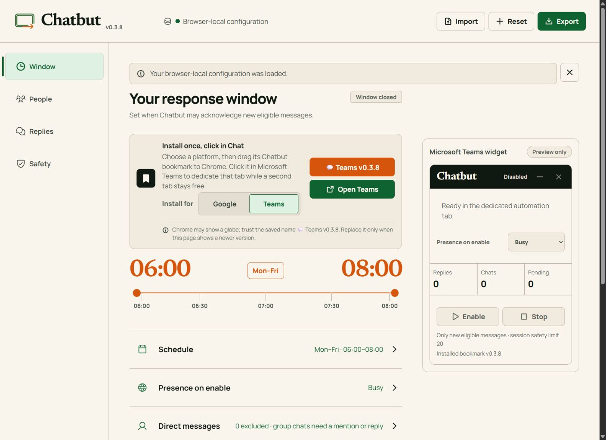

<p align="center">
  
</p>

<h1 align="center">Chatbut</h1>

<p align="center">
  Thoughtful, scheduled acknowledgements for Google Chat and Microsoft Teams.
</p>

<p align="center">
  <strong>No installation · No Chatbut account · No Google or Microsoft API connection · AI optional</strong>
</p>

<p align="center">
  <a href="https://jiannystein.github.io/chatbut/"><strong>Open Chatbut</strong></a>
  ·
  <a href="#quick-start">Quick start</a>
  ·
  <a href="#privacy-and-safety">Privacy and safety</a>
  ·
  <a href="SECURITY.md">Security policy</a>
</p>

<p align="center">
  <a href="https://github.com/jiannystein/chatbut/actions/workflows/deploy-pages.yml"></a>
  <a href="LICENSE"></a>
  
</p>

Chatbut is a local-first Chrome bookmarklet for people who cannot install
software on their work computer. While an enabled chat tab remains open, it
watches for eligible new messages and sends a short acknowledgement from the
user's own signed-in account.

It is an experimental proof of concept. Please begin with non-sensitive test
conversations and confirm that browser automation is permitted by your
organization.

<table>
  <tr>
    <th>Google Chat</th>
    <th>Microsoft Teams</th>
  </tr>
  <tr>
    <td></td>
    <td></td>
  </tr>
</table>

## Why a bookmarklet?

A bookmarklet is a browser bookmark containing a small program. Chatbut needs
no extension, installer, Chatbut account, Google OAuth consent, Microsoft
Graph connection, hosted backend, or background service.

AI is not required. By default, Chatbut chooses from saved responses and sends
no conversation text to an AI provider. Optional wording adaptation can be
enabled with the user's own provider API key.

The trade-off is simple: the dedicated chat tab must remain open, the computer
must stay awake, and changes to Google Chat or Teams may require a Chatbut
update.

## Quick start

1. Open [Chatbut](https://jiannystein.github.io/chatbut/) in desktop Chrome and
   create a browser-local configuration.
2. Review the schedule, saved responses, people, presence, and safety settings.
3. Select **Google** or **Teams**, then drag **💬 Google v0.3.8** or
   **💬 Teams v0.3.8** to the bookmarks bar.
4. Open the matching chat website and click that bookmark. Confirm that the
   current tab may become the dedicated automation tab.
5. Review the compact widget, then select **Enable**. Use the second tab for
   normal chat activity and leave the automation tab open.
6. Select **Stop** at any time. Reloading or closing the automation tab also
   disables Chatbut.

Configuration is stored in this Chrome profile and updates the connected
bookmark automatically. Re-add the bookmark only when Chatbut shows a newer
version.

## Important behavior

- Supports scheduled windows, **Enable now**, countdowns, optional presence
  changes, minimize, and immediate Stop.
- Covers eligible 1:1 messages. Group DMs, Google Spaces, and Teams channels
  require stricter mention, reply, and opt-in rules.
- Ignores Teams meeting chats.
- Allows a two-reply Teams self-chat test during each enabled session.
- Responds only to eligible messages detected after Enable.
- Sends at most one follow-up after another eligible message and the configured
  cooldown.
- Stops after 20 replies per platform session and shares a five-send,
  five-minute safety limit across Google Chat and Teams.
- Uses the rendered web interface rather than undocumented Google or Microsoft
  private APIs.

Chatbut never tries to answer the substance of a message. Its purpose is only
to acknowledge receipt and defer the conversation respectfully.

## Privacy and safety

- Chatbut has no backend, account system, analytics, telemetry, or cloud sync.
  Configuration and optional logs stay in browser-local storage.
- Without optional AI adaptation, conversation text is not sent to an AI
  provider.
- With adaptation enabled, the selected template and configured recent message
  context are sent directly to the chosen provider.
- Provider keys are plaintext browser data in this proof of concept and are
  included in exported configuration backups.
- Ambiguous identities, targets, messages, or composers are skipped rather
  than guessed.
- Existing unread messages are quarantined when a session begins, and the
  target and composer are checked again before sending.
- Manual activity protects that conversation from further automatic replies
  during the session.

No automated scanner can prove that software is safe. This public repository
uses test-gated builds, GitHub secret scanning and push protection, and
GitGuardian pull-request checks to reduce avoidable risk. Independent review is
welcome.

Please read [SECURITY.md](SECURITY.md) before using Chatbut with workplace
conversations. Local-only operation does not automatically make a tool
policy-approved.

## Limitations

- Chrome desktop only.
- Google Chat web and Microsoft Teams work/school web v2 only.
- Teams Personal/Free, legacy Teams, mobile clients, and meeting chats are not
  supported.
- Managed-browser policies may block bookmarklets, helper tabs, SharedWorker,
  IndexedDB, or optional provider access.
- DOM automation is inherently fragile and may stop working after a chat
  interface update.
- Invitation automation and every optional AI provider have automated coverage
  but have not completed the full live acceptance matrix.

## Development

Requirements: Node.js 24 and desktop Chrome.

```bash
cd app
npm ci
npm audit
npm test
npm run test:sites
npm run build
npm run dev
```

Readable Google Chat and Teams runtimes are in
`app/src/bookmarklet/`. Generated bookmarklets are independently limited to
32 KB.

## License

[MIT](LICENSE). Chatbut is not affiliated with or endorsed by Google or
Microsoft.
