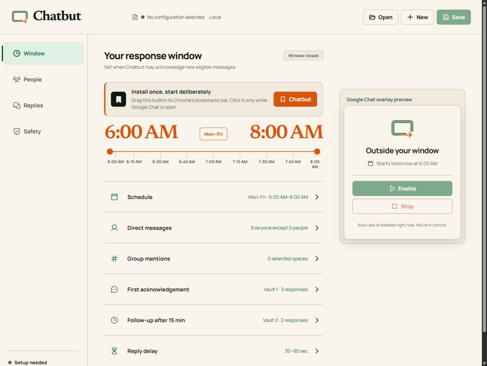

<p align="center">
  
</p>

<h1 align="center">Chatbut</h1>

<p align="center">
  Scheduled, guarded acknowledgements for Google Chat—without installing an app or extension.
</p>

<p align="center">
  <a href="https://jiannystein.github.io/chatbut/"><strong>Open Chatbut</strong></a>
  ·
  <a href="#how-it-works">How it works</a>
  ·
  <a href="#privacy-and-security">Privacy</a>
  ·
  <a href="#limitations">Limitations</a>
</p>

<p align="center">
  <a href="https://github.com/jiannystein/chatbut/actions/workflows/deploy-pages.yml"></a>
  <a href="LICENSE"></a>
  
</p>



Chatbut is a local-first Chrome bookmarklet for people who receive Google Chat
messages outside their working hours but cannot install software on their work
machine. It watches an open Google Chat tab during a schedule you choose and
sends a short acknowledge-and-defer response from your own signed-in account.

This repository contains a proof of concept. Use non-sensitive test chats first.

## Why a bookmarklet?

A bookmarklet is a saved browser bookmark containing a small program. Chatbut
uses that model so there is no extension, desktop installer, Google OAuth
consent, hosted account, or background service.

The trade-off is deliberate: Google Chat must remain open, the computer must
remain awake, and Google interface changes may require Chatbut updates.

## What the MVP does

| Area | Behavior |
| --- | --- |
| Schedule | Selected days and start/end times in the browser's timezone |
| Direct messages | Everyone except conversations on the exclusion list |
| Spaces | Selected Spaces only; requires an `@mention` or a verified direct reply |
| First response | Random Vault 1 template after a configurable 30–90 second delay |
| Follow-up | At most one Vault 2 response after the cooldown and another eligible message |
| AI adaptation | Optional DeepSeek BYOK; otherwise sends the saved template unchanged |
| Invitations | Separate, off-by-default controls for human 1:1 requests and Space invitations |
| Safety | Manual enable, schedule enforcement, per-session limits, one active tab, immediate stop |
| Storage | Versioned plaintext JSON file selected by the user |
| Logging | None by default; optional rotating local debug files |

Chatbut never answers the substance of a message. AI adaptation, when enabled,
is constrained to a casual, empathetic, workplace-appropriate acknowledgement
of no more than two sentences. If DeepSeek fails, Chatbut uses the original
saved template.

## Quick start

1. Open the [Chatbut configurator](https://jiannystein.github.io/chatbut/) in
   desktop Chrome.
2. Drag the **Chatbut** button to Chrome's bookmarks bar.
3. Create a local configuration file and review the schedule, targets, response
   vaults, and safety controls.
4. If you want AI adaptation, enable it, add your own DeepSeek key, and validate
   it. AI is optional.
5. Save the file.
6. Open [Google Chat](https://chat.google.com/app/home), click the Chatbut
   bookmark, choose the same configuration file, and select **Enable**.

Reloading or closing the Google Chat tab disables Chatbut. This is intentional:
the user must start every session explicitly.

## How it works

```text
GitHub Pages configurator
        │
        ├── creates a local JSON configuration
        └── provides the generated bookmarklet
                         │
                         ▼
               Google Chat browser tab
                         │
             rendered DOM signals only
                         │
        ┌────────────────┴────────────────┐
        │                                 │
 saved response                  optional DeepSeek
        │                        wording adaptation
        └────────────────┬────────────────┘
                         ▼
             re-verify target + composer
                         │
                         ▼
              normal message from user
```

The runtime uses the rendered Google Chat interface; it does not call
undocumented Google private network APIs. It records a baseline at enable time,
coalesces message bursts, navigates to an eligible conversation, verifies the
conversation again immediately before sending, and restores the chat that was
previously open.

Opening conversations may mark them read or visibly change the interface for a
moment.

## Privacy and security

- The configuration and optional logs stay in files selected on the user's
  computer. Chatbut has no backend, account system, analytics, or telemetry.
- The optional DeepSeek API key is stored in plaintext in the configuration
  file. Anyone or any process that can read the file can read the key.
- When AI adaptation is enabled, the configured 3–10 recent text messages and
  a selected response template are sent directly from the browser to DeepSeek.
- When AI is disabled, no chat content is sent to DeepSeek.
- Debug logging is off by default. When enabled, logs may contain full message
  context; credentials and authorization headers are redacted and files rotate
  at 10 MB.
- Local storage is not automatically safe on a shared or managed computer.
  Organizational data-handling policy still applies.

See [SECURITY.md](SECURITY.md) before testing with workplace conversations.

## Safety boundaries

- Only messages detected after the current enable time are eligible. A message
  attached to an invitation accepted during the session is the explicit
  exception.
- A manual user edit in a conversation stops automation for that conversation
  until the next enable.
- A Space must be selected and its message must mention or directly reply to
  the user.
- Bots, apps, uncertain identities, ambiguous composers, and unsupported
  message structures are skipped.
- Chatbut stops after 20 automatic replies in a session or 5 in a rolling
  five-minute period.
- The configured schedule and conversation identity are checked again before
  every send.

## Limitations

- Chrome desktop only for the MVP.
- Google Chat must remain open and the computer awake.
- Managed-browser policy may block bookmarklets, file access, or DeepSeek.
- Browser DOM automation is inherently fragile and can break after a Google
  Chat interface update.
- Direct-reply detection is fail-closed: Chatbut skips a message unless it can
  verify the reply target.
- Invitation discovery depends on the English Google Chat interface in this
  POC.
- Microsoft Teams is not implemented yet.

## Local development

Requirements: Node.js 24 and desktop Chrome.

```bash
cd app
npm ci
npm test
npm run build
npm run test:sites
npm run dev
```

`npm run build:bookmarklet` bundles readable source into a self-contained,
encoded bookmarklet and fails if the artifact exceeds the 32 KB budget.

## Repository structure

```text
.
├── app/
│   ├── src/                    # React configurator and shared behavior
│   │   └── bookmarklet/        # Readable bookmarklet runtime and pure logic
│   ├── scripts/                # Deterministic bookmarklet/Sites builds
│   ├── tests/                  # Scheduling, state, safety, and packaging tests
│   └── public/                 # Logo and generated bookmarklet artifacts
├── .github/workflows/          # Test-gated GitHub Pages deployment
├── plan.md                     # Product decisions and acceptance criteria
└── SECURITY.md                 # POC security guidance
```

## Project status

Chatbut is an experimental POC intended to improve response experience, not a
supported Google integration. Review [plan.md](plan.md) for the complete product
decisions, known risks, and acceptance criteria.

Chatbut is not affiliated with, endorsed by, or sponsored by Google, Google
Chat, Microsoft, Microsoft Teams, or DeepSeek. Google Chat and Chrome are
trademarks of Google LLC. This project took structural inspiration from the
author's earlier bookmarklet utility, InstaUnfollow, but uses different
automation, safety, privacy, and product design.

## License

[MIT](LICENSE)
